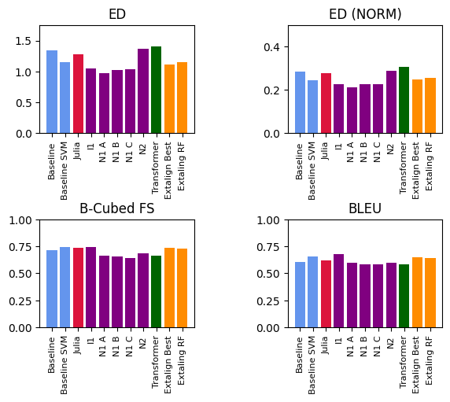
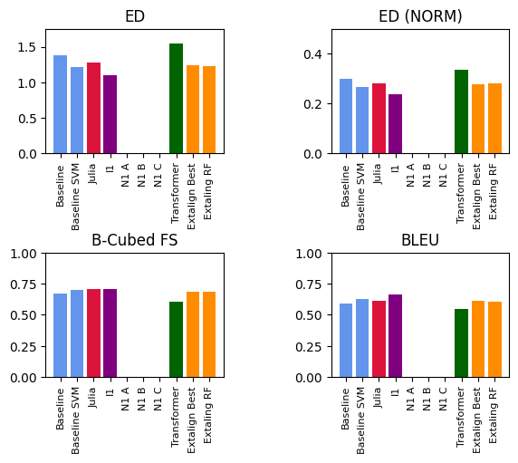
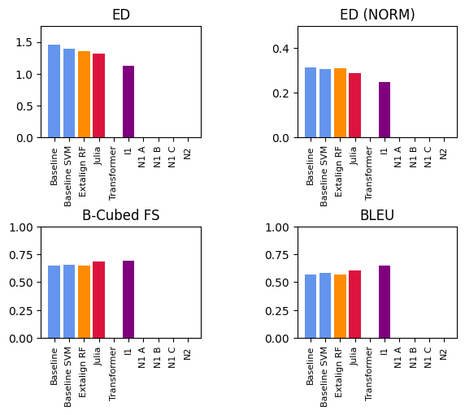
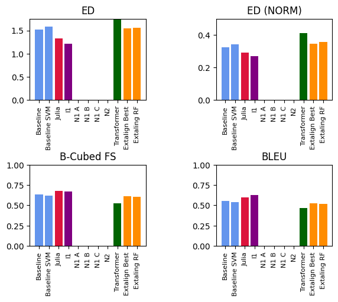
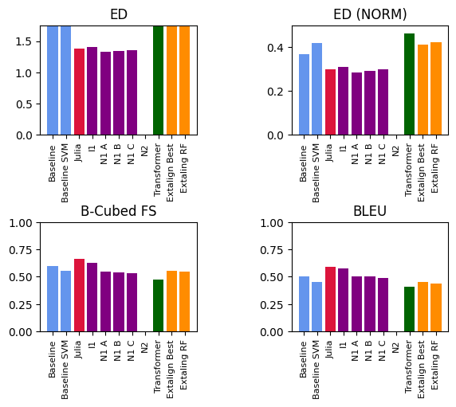
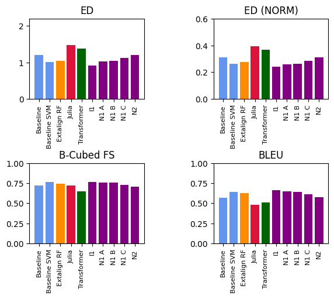
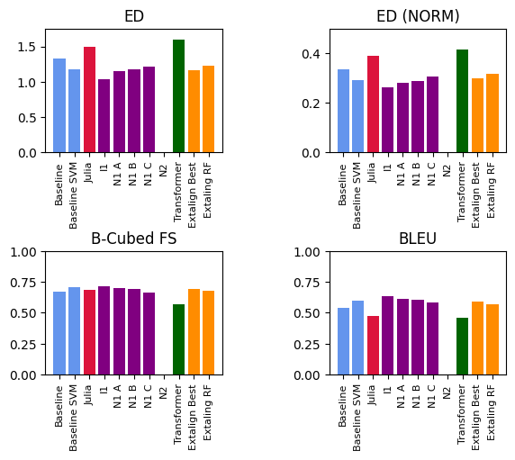
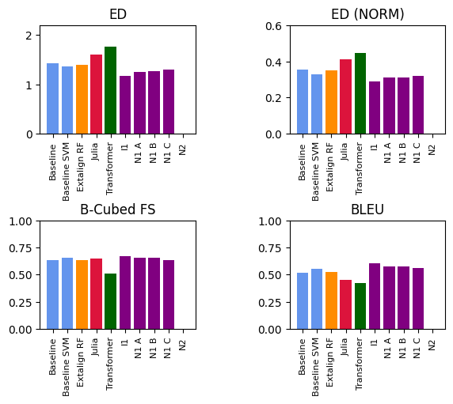
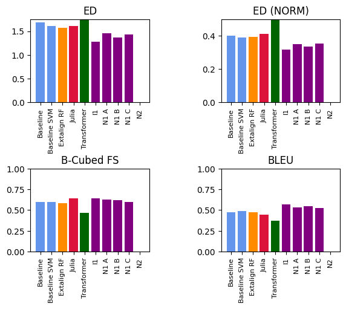
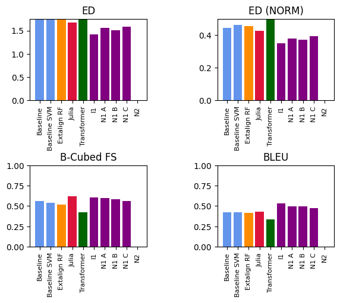

# Results for the Comparison

Here, we list the results in the form of plots.
We list results for both Training and Surprise data. Training data is merely for checking if systems greatly differ for some reason, with respect to their results from the performance on the surprise data, which might warrant to double check with the code of the system. In some cases, the teams also could not provide all data for the individual training sets, due to time limitations and for other reasons.

To create the systems, you can most conveniently use our Makefile:

```
$ make compare-systems-training
$ make compare-systems-surprise
```

This yields as the output individual results in tabular form, which you can find in the files [results-training-0.10.md](results-training-0.10.md), 
[results-training-0.20.md](results-training-0.20.md),
[results-training-0.30.md](results-training-0.30.md),
[results-training-0.40.md](results-training-0.40.md), and
[results-training-0.50.md](results-training-0.50.md).

For the surprise data, the results can then be found in the files [results-surprise-0.10.md](results-surprise-0.10.md), 
[results-traning-0.20.md](results-surprise-0.20.md),
[results-traning-0.30.md](results-surprise-0.30.md),
[results-traning-0.40.md](results-surprise-0.40.md), and
[results-traning-0.50.md](results-surprise-0.50.md), respectively.

The resulting plots are also listed below.

## Results for the Training Partition (Proportion 0.10)

```
SYSTEM                      ED    ED (NORM)    B-Cubed FS    BLEU
----------------------  ------  -----------  ------------  ------
Baseline-Baseline       1.3407       0.2835        0.7156  0.6057
Baseline-Baseline-SVM   1.1563       0.2435        0.7435  0.6577
Jaeger-Julia            1.2778       0.2785        0.7399  0.6197
Mockingbird-I1          1.0528       0.2255        0.7447  0.6805
Mockingbird-N1-A        0.9727       0.2135        0.6653  0.5989
Mockingbird-N1-B        1.0266       0.2257        0.6544  0.5833
Mockingbird-N1-C        1.0362       0.2283        0.6443  0.5821
PRECOR-Transformer      1.4059       0.3069        0.6666  0.5826
Tresoldi-Extalign-Best  1.1140       0.2487        0.7382  0.6485
Tresoldi-Extaling-RF    1.1469       0.2573        0.7313  0.6418
```



## Results for the Training Partition (Proportion 0.20)

```
SYSTEM                      ED    ED (NORM)    B-Cubed FS    BLEU
----------------------  ------  -----------  ------------  ------
Baseline-Baseline       1.4626       0.3128        0.6525  0.5698
Baseline-Baseline-SVM   1.3959       0.3070        0.6534  0.5818
Jaeger-Julia            1.3194       0.2894        0.6879  0.6055
Mockingbird-I1          1.1297       0.2501        0.6902  0.6498
Mockingbird-N1-A        0.0000       0.0000        0.0000  0.0000
Mockingbird-N1-B        0.0000       0.0000        0.0000  0.0000
Mockingbird-N1-C        0.0000       0.0000        0.0000  0.0000
PRECOR-Transformer      1.6964       0.3719        0.5649  0.5130
Tresoldi-Extalign-Best  1.3493       0.3066        0.6538  0.5795
Tresoldi-Extaling-RF    1.3607       0.3118        0.6499  0.5710
```



## Results for the Training Partition (Proportion 0.30)

```
SYSTEM                      ED    ED (NORM)    B-Cubed FS    BLEU
----------------------  ------  -----------  ------------  ------
Baseline-Baseline       1.4626       0.3128        0.6525  0.5698
Baseline-Baseline-SVM   1.3959       0.3070        0.6534  0.5818
Jaeger-Julia            1.3194       0.2894        0.6879  0.6055
Mockingbird-I1          1.1297       0.2501        0.6902  0.6498
Mockingbird-N1-A        0.0000       0.0000        0.0000  0.0000
Mockingbird-N1-B        0.0000       0.0000        0.0000  0.0000
Mockingbird-N1-C        0.0000       0.0000        0.0000  0.0000
PRECOR-Transformer      1.6964       0.3719        0.5649  0.5130
Tresoldi-Extalign-Best  1.3493       0.3066        0.6538  0.5795
Tresoldi-Extaling-RF    1.3607       0.3118        0.6499  0.5710
```



## Results for the Training Partition (Proportion 0.40)

```
SYSTEM                      ED    ED (NORM)    B-Cubed FS    BLEU
----------------------  ------  -----------  ------------  ------
Baseline-Baseline       1.5184       0.3242        0.6354  0.5515
Baseline-Baseline-SVM   1.5902       0.3451        0.6173  0.5365
Jaeger-Julia            1.3342       0.2922        0.6760  0.6007
Mockingbird-I1          1.2121       0.2693        0.6686  0.6240
Mockingbird-N1-A        0.0000       0.0000        0.0000  0.0000
Mockingbird-N1-B        0.0000       0.0000        0.0000  0.0000
Mockingbird-N1-C        0.0000       0.0000        0.0000  0.0000
PRECOR-Transformer      1.8622       0.4132        0.5229  0.4704
Tresoldi-Extalign-Best  1.5431       0.3478        0.6129  0.5286
Tresoldi-Extaling-RF    1.5641       0.3572        0.6070  0.5156
```



## Results for the Training Partition (Proportion 0.50)

```
SYSTEM                      ED    ED (NORM)    B-Cubed FS    BLEU
----------------------  ------  -----------  ------------  ------
Baseline-Baseline       1.7541       0.3697        0.5978  0.5001
Baseline-Baseline-SVM   1.9828       0.4206        0.5530  0.4489
Jaeger-Julia            1.3762       0.2993        0.6647  0.5914
Mockingbird-I1          1.4034       0.3088        0.6307  0.5787
Mockingbird-N1-A        1.3301       0.2859        0.5492  0.5053
Mockingbird-N1-B        1.3407       0.2909        0.5400  0.5002
Mockingbird-N1-C        1.3515       0.2986        0.5308  0.4918
PRECOR-Transformer      2.1331       0.4654        0.4730  0.4110
Tresoldi-Extalign-Best  1.8577       0.4123        0.5552  0.4539
Tresoldi-Extaling-RF    1.8933       0.4230        0.5437  0.4398
```



## Results for the Surprise Partition (Proportion 0.10)

```
SYSTEM                      ED    ED (NORM)    B-Cubed FS    BLEU
----------------------  ------  -----------  ------------  ------
Baseline-Baseline       1.2095       0.3119        0.7231  0.5716
Baseline-Baseline-SVM   1.0189       0.2625        0.7626  0.6387
Jaeger-Julia            1.4804       0.3929        0.7251  0.4793
Mockingbird-I1          0.9201       0.2431        0.7673  0.6633
Mockingbird-N1-A        1.0223       0.2568        0.7604  0.6479
Mockingbird-N1-B        1.0437       0.2625        0.7572  0.6398
Mockingbird-N1-C        1.1263       0.2867        0.7302  0.6115
PRECOR-Transformer      1.3506       0.3690        0.6571  0.5147
Tresoldi-Extalign-Best  0.9894       0.2621        0.7615  0.6418
Tresoldi-Extaling-RF    1.0377       0.2763        0.7475  0.6243
```



## Results for the Surprise Partition (Proportion 0.20)

```
SYSTEM                      ED    ED (NORM)    B-Cubed FS    BLEU
----------------------  ------  -----------  ------------  ------
Baseline-Baseline       1.3253       0.3361        0.6680  0.5412
Baseline-Baseline-SVM   1.1723       0.2928        0.7067  0.5985
Jaeger-Julia            1.4954       0.3912        0.6882  0.4760
Mockingbird-I1          1.0413       0.2648        0.7120  0.6326
Mockingbird-N1-A        1.1512       0.2825        0.7011  0.6138
Mockingbird-N1-B        1.1726       0.2901        0.6910  0.6054
Mockingbird-N1-C        1.2196       0.3051        0.6669  0.5841
PRECOR-Transformer      1.5915       0.4148        0.5661  0.4598
Tresoldi-Extalign-Best  1.1685       0.3006        0.6908  0.5886
Tresoldi-Extaling-RF    1.2208       0.3175        0.6798  0.5709
```



## Results for the Surprise Partition (Proportion 0.30)

```
SYSTEM                      ED    ED (NORM)    B-Cubed FS    BLEU
----------------------  ------  -----------  ------------  ------
Baseline-Baseline       1.4354       0.3556        0.6372  0.5195
Baseline-Baseline-SVM   1.3713       0.3310        0.6565  0.5554
Jaeger-Julia            1.6116       0.4130        0.6508  0.4503
Mockingbird-I1          1.1762       0.2899        0.6717  0.6059
Mockingbird-N1-A        1.2565       0.3119        0.6557  0.5779
Mockingbird-N1-B        1.2712       0.3103        0.6531  0.5792
Mockingbird-N1-C        1.3009       0.3215        0.6343  0.5636
PRECOR-Transformer      1.7683       0.4487        0.5214  0.4213
Tresoldi-Extalign-Best  1.3759       0.3412        0.6439  0.5445
Tresoldi-Extaling-RF    1.4038       0.3525        0.6331  0.5286
```


## Results for the Surprise Partition (Proportion 0.40)

```
SYSTEM                      ED    ED (NORM)    B-Cubed FS    BLEU
----------------------  ------  -----------  ------------  ------
Baseline-Baseline       1.6821       0.4011        0.6001  0.4717
Baseline-Baseline-SVM   1.6159       0.3891        0.5990  0.4903
Jaeger-Julia            1.6059       0.4112        0.6411  0.4473
Mockingbird-I1          1.2725       0.3162        0.6428  0.5724
Mockingbird-N1-A        1.4542       0.3521        0.6294  0.5293
Mockingbird-N1-B        1.3618       0.3349        0.6212  0.5466
Mockingbird-N1-C        1.4353       0.3547        0.5999  0.5228
PRECOR-Transformer      1.9148       0.4878        0.4758  0.3810
Tresoldi-Extalign-Best  1.5362       0.3836        0.5983  0.4929
Tresoldi-Extaling-RF    1.5695       0.3960        0.5805  0.4773
```



## Results for the Surprise Partition (Proportion 0.50)

```
SYSTEM                      ED    ED (NORM)    B-Cubed FS    BLEU
----------------------  ------  -----------  ------------  ------
Baseline-Baseline       1.8889       0.4445        0.5617  0.4265
Baseline-Baseline-SVM   1.9330       0.4619        0.5371  0.4204
Jaeger-Julia            1.6794       0.4274        0.6193  0.4296
Mockingbird-I1          1.4170       0.3518        0.6050  0.5337
Mockingbird-N1-A        1.5527       0.3800        0.5959  0.4934
Mockingbird-N1-B        1.5066       0.3734        0.5864  0.4989
Mockingbird-N1-C        1.5818       0.3950        0.5610  0.4749
PRECOR-Transformer      2.1210       0.5377        0.4295  0.3349
Tresoldi-Extalign-Best  1.7830       0.4372        0.5438  0.4375
Tresoldi-Extaling-RF    1.8434       0.4576        0.5194  0.4128
```




