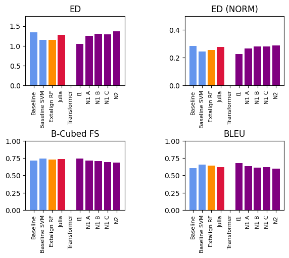
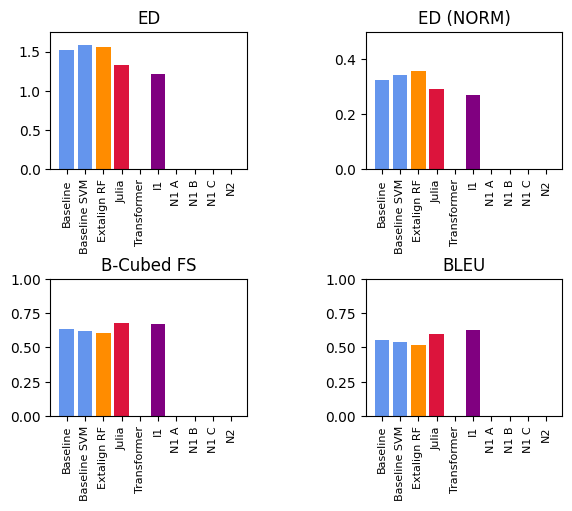
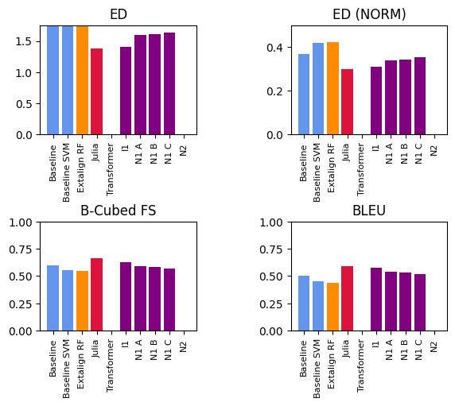
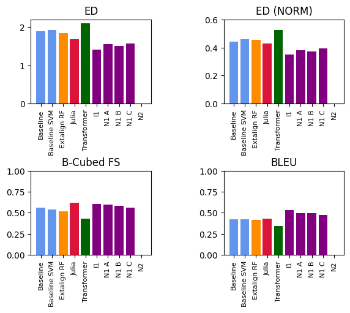

# Results for the Comparison

Here, we list the results in the form of plots.
We list results for both Training and Surprise data. Training data is merely for checking if systems greatly differ for some reason, with respect to their results from the performance on the surprise data, which might warrant to double check with the code of the system. In some cases, the teams also could not provide all data for the individual training sets, due to time limitations and for other reasons.

To create the systems, you can most conveniently use our Makefile:

```
$ make compare-systems-training
$ make compare-systems-surprise
```

This yields as the output individual results in tabular form, which you can find in the files [results-training-0.10.md](results-training-0.10.md), 
[results-training-0.20.md](results-training-0.20.md),
[results-training-0.30.md](results-training-0.30.md),
[results-training-0.40.md](results-training-0.40.md), and
[results-training-0.50.md](results-training-0.50.md).

For the surprise data, the results can then be found in the files [results-surprise-0.10.md](results-surprise-0.10.md), 
[results-traning-0.20.md](results-surprise-0.20.md),
[results-traning-0.30.md](results-surprise-0.30.md),
[results-traning-0.40.md](results-surprise-0.40.md), and
[results-traning-0.50.md](results-surprise-0.50.md), respectively.

The resulting plots are also listed below.

## Results for the Training Partition (Proportion 0.10)



## Results for the Training Partition (Proportion 0.20)


## Results for the Training Partition (Proportion 0.30)


## Results for the Training Partition (Proportion 0.40)



## Results for the Training Partition (Proportion 0.50)



## Results for the Surprise Partition (Proportion 0.10)


## Results for the Surprise Partition (Proportion 0.20)


## Results for the Surprise Partition (Proportion 0.30)


## Results for the Surprise Partition (Proportion 0.40)


## Results for the Surprise Partition (Proportion 0.50)




